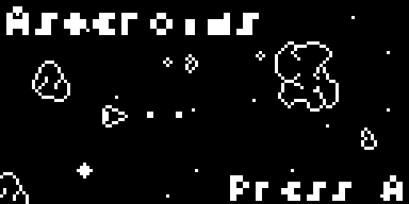

# Asteroids
A classic re-imagined for the Spike.



Each of the games I've made so far explore a new programming challenge. In this one it was drawing sprites to the screen using a transparency mask. Since the game has a starfield background, I didn't want the stars shining through the asteroids which only have an outline.

The function for displaying a sprite on screen is fairly involved, but the key bit of code looks like this:

```
        if (y_offset_a < 8)
        {
            buffer[tile_start+tile_offset] &= (mask[glyph_index] << y_offset_a) | ~(0xff << y_offset_a);
            buffer[tile_start+tile_offset] |= glyph[glyph_index] << y_offset_a;
        }
        if (y_offset_b < 8)
        {
            buffer[tile_start+SCREEN_WIDTH+tile_offset] &= (mask[glyph_index] >> y_offset_b) | ~(0xff >> y_offset_b);
            buffer[tile_start+SCREEN_WIDTH+tile_offset] |= glyph[glyph_index] >> y_offset_b;
        }
```

Given a sprite S:

```
    byte S[] = { 0b00000000,
                 0b00110000,
                 0b01001000,
                 0b01001000,
                 0b10000100,
                 0b10000100,
                 0b11111100,
                 0b00000000, };
```

When it's drawn on top of a background, I want the 'inside' to always be black, but the outside can be whatever is already drawn.

Using a mask M:

```
    byte M[] = { 0b11111111,
                 0b11111111,
                 0b11001111,
                 0b11001111,
                 0b10000111,
                 0b10000111,
                 0b11111111,
                 0b11111111, };
```

I can first AND the mask with the background tile T:

```
    byte T[] = { 0b00010000,
                 0b00010000,
                 0b00010000,
                 0b11111111,
                 0b11111111,
                 0b00010000,
                 0b00010000,
                 0b00010000, };
```

which gives:

```
    byte T_[] = { 0b00010000,
                  0b00010000,
                  0b00000000,
                  0b11001111,
                  0b10000111,
                  0b00000000,
                  0b00010000,
                  0b00010000, };
```

and finally the sprite can be OR'd onto the buffer B:

```
    byte T_[] = { 0b00010000,
                  0b00110000,
                  0b01000100,
                  0b11001111,
                  0b10000111,
                  0b10000100,
                  0b11111100,
                  0b00010000, };
```

There's a little bit more to it in order to then split the write across 2 bytes whenever the sprite is between a buffer grid boundary, but this is the general gist of it.